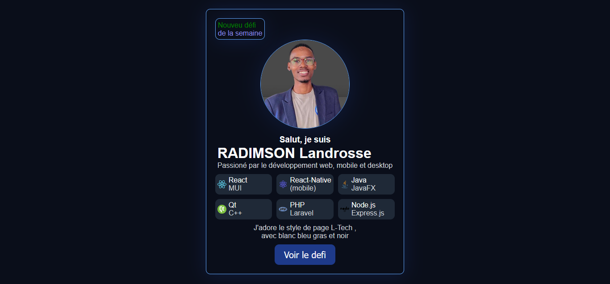
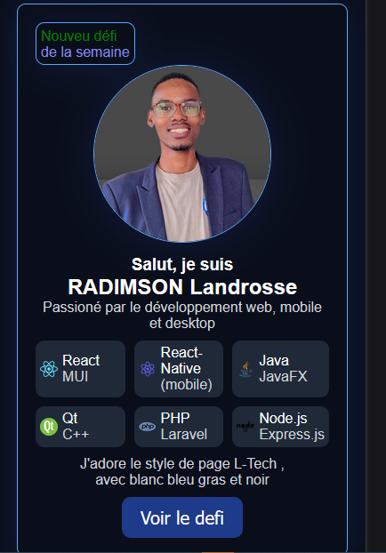

# 🧑‍💻 Carte de Profil – RADIMSON Landrosse

Une carte de présentation interactive réalisée en HTML et CSS. Elle met en avant mon profil de développeur fullstack passionné par le **web**, le **mobile** et le **desktop**. Le design s'inspire des tendances modernes avec une palette personnalisée : **L-Tech** (blanc, bleu gras, noir).

---

## 🔍 Aperçu




---

## 🚀 Technologies utilisées

- HTML5
- CSS3 (animations, flexbox)
- [Font Awesome](https://fontawesome.com) pour les icônes
- Palette de couleurs personnalisée (L-Tech)
- Design inspiré de composants UI modernes

---

## 📌 Contenu de la carte

- **Nom** : RADIMSON Landrosse
- **Bio** : Développeur passionné par le web, le mobile et le desktop
- **Compétences avec icônes** :
  - 🌐 **React** + Material UI (Web)
  - 📱 **React Native** (Mobile)
  - 🖥️ **Java/JavaFX**, **C++ avec Qt** (Desktop)
  - ⚙️ **PHP Laravel**, **Express.js** (Backend)

---

## ✨ Fonctionnalités

- Animation au survol (hover effect)
- Interface responsive
- Thème clair et pro : blanc + bleu gras + noir
- Effet d’apparition élégant

---

## 🧪 Comment tester

1. Clone ce dépôt :
   ```bash
   git clone https://github.com/landrosdev/ma-carte-profil.git
